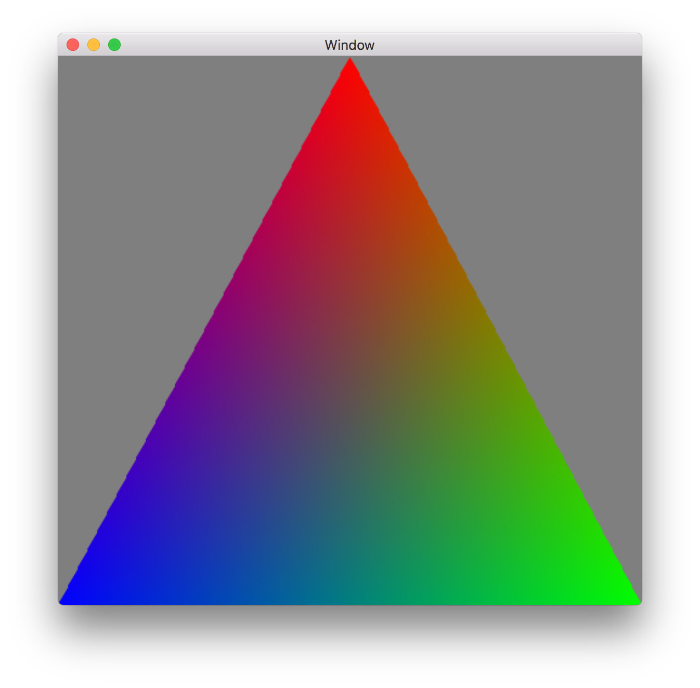
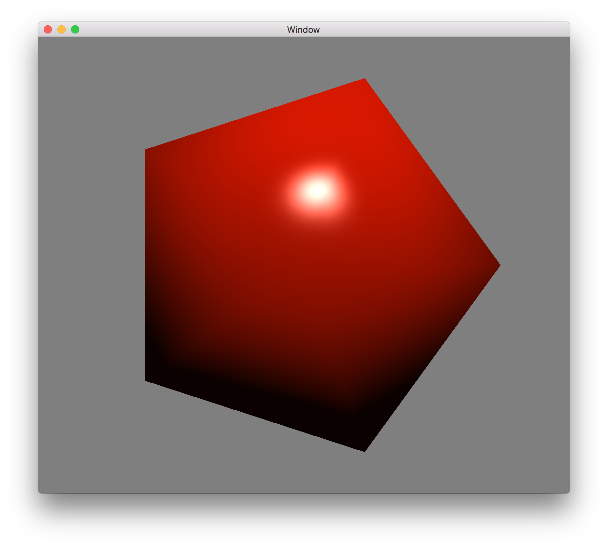
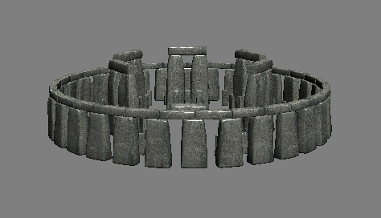
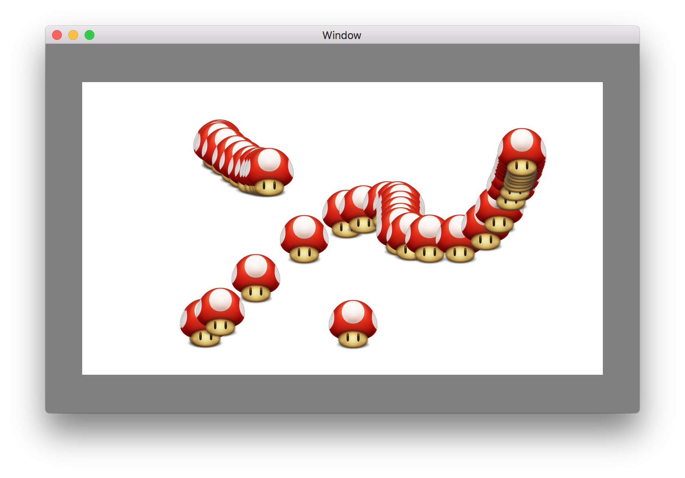

# MetalTalk
Demos accompanying Ryder Mackay’s Metal talk at TACOW September 8, 2015.

## Hello Triangle (Mac & iOS)

## Hello Icosahedron

Basic 3D rendering, lighting + interaction.

## Stonehenge

ModelIO integration.

## Metal Mario Paint

- Texture stamping
- CoreImage integration
- CoreVideo integration

Change `let demo = Demo.Paint` to switch demos.

## Metal Performance Shaders
- Requires A8(x) iOS device
